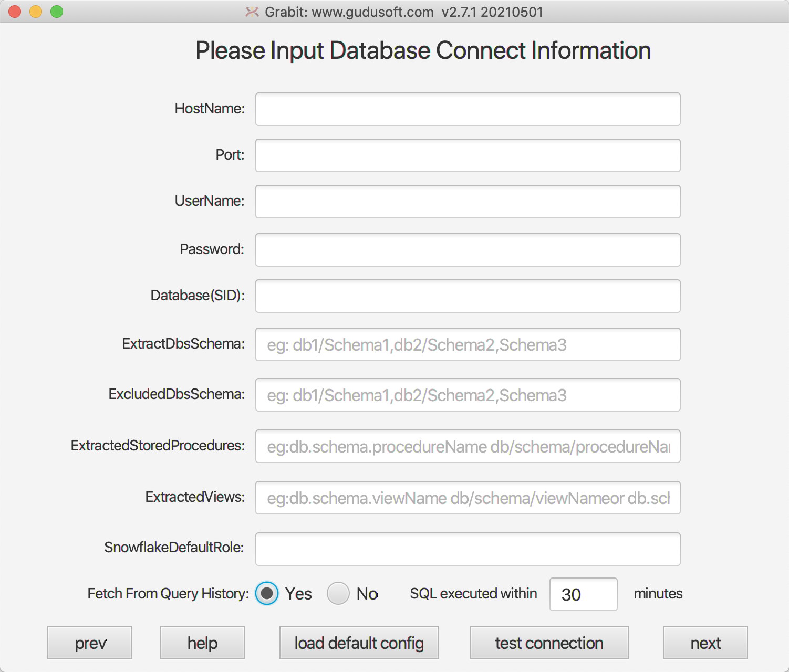

## Grabit Databse Connection Information Document

Specify a database instance that grabit will connect to fetch the metadata that helps SQLFlow make a more precise analysis and get a more accurate result of data lineage.

#### Databse Connection Information UI


#### Parameter Specification Of Connection Information

####  hostname

The IP of the database server that the grabit connects.

#### port

The port number of the database server that the grabit connect.

#### username

The database user used to login to the database.

#### password

The password of the database user.

note: the passwords can be encrypted using tools [Encrypted password](#Encrypted password), using encrypted passwords more secure.

#### privateKeyFile

Use a private key to connect, Only supports the `snowflake`.

#### privateKeyFilePwd

Generate the password for the private key, Only supports the `snowflake`.

#### database

The name of the database instance to which it is connected. 

For azure,greenplum,netezza,oracle,postgresql,redshift,teradata databases, it represents the database name and is required, For other databases, it is optional.

`
note: 
If this parameter is specified and the database to which it is connected is Azure, Greenplum, PostgreSQL, or Redshift, then only metadata under that library is extracted.
`

#### extractedDbsSchemas

List of databases and schemas to extract, separated by
commas, which are to be provided in the format database/schema;
Or blank to extract all databases.
`database1/schema1,database2/schema2,database3` or `database1.schema1,database2.schema2,database3`
When parameter `database` is filled in, this parameter is considered a schema.
And support wildcard characters such as `database1/*`,`*/schema`,`*/*`.

When the connected databases are `Oracle` and `Teradata`, this parameter is set the schemas, for example:

````json
extractedDbsSchemas: "HR,SH"
````

When the connected databases are `Mysql` , `Sqlserver`, `Postgresql`, `Snowflake`, `Greenplum`, `Redshift`, `Netezza`, `Azure`, this parameter is set database/schema, for example:

````json
extractedDbsSchemas: "MY/ADMIN"
````


#### excludedDbsSchemas

This parameters works under the resultset filtered by `extractedDbsSchemas`.
List of databases and schemas to exclude from extraction, separated by commas
`database1/schema1,database2` or `database1.schema1,database2` 
When parameter `database` is filled in, this parameter is considered a schema.
And support wildcard characters such as `database1/*`,`*/schema`,`*/*`.

When the connected databases are `Oracle` and `Teradata`, this parameter is set the schemas, for example:

````json
excludedDbsSchemas: "HR"
````

When the connected databases are `Mysql` , `Sqlserver`, `Postgresql`, `Snowflake`, `Greenplum`, `Redshift`, `Netezza`, `Azure`, this parameter is set database/schema, for example:

````json
excludedDbsSchemas: "MY/*"
````

#### extractedStoredProcedures

A list of stored procedures under the specified database and schema to extract, separated by
commas, which are to be provided in the format database.schema.procedureName or schema.procedureName;
Or blank to extract all databases, support expression.
`database1.schema1.procedureName1,database2.schema2.procedureName2,database3.schema3,database4` or `database1/schema1/procedureName1,database2/schema2`

for example:

````json
extractedStoredProcedures: "database.scott.vEmp*"
````

or

````json
extractedStoredProcedures: "database.scott"
````

#### extractedViews

A list of stored views under the specified database and schema to extract, separated by
commas, which are to be provided in the format database.schema.viewName or schema.viewName.
Or blank to extract all databases, support expression.
`database1.schema1.procedureName1,database2.schema2.procedureName2,database3.schema3,database4` or `database1/schema1/procedureName1,database2/schema2`

for example:

````json
extractedViews: "database.scott.vEmp*"
````

or

````json
extractedViews: "database.scott"
````

#### enableQueryHistory

Fetch SQL queries from the query history if set to `true` default is false.

#### queryHistoryBlockOfTimeInMinutes

When `enableQueryHistory:true`, the interval at which the SQL query was extracted in the query History,default is `30` minutes.

#### queryHistorySqlType

When `enableQueryHistory:true`, the DML type of SQL is extracted from the query History.
When empty, all types are extracted, and when multiple types are specified, a comma separates them, such as `SELECT,UPDATE,MERGE`.
Currently only the snowflake database supports this parameter,support types are **SHOW,SELECT,INSERT,UPDATE,DELETE,MERGE,CREATE TABLE, CREATE VIEW, CREATE PROCEDURE, CREATE FUNCTION**.

for example:

````json
queryHistorySqlType: "SELECT,DELETE"
````

#### snowflakeDefaultRole

This value represents the role of the snowflake database.

````
note: You must define a role that has access to the SNOWFLAKE database,And assign WAREHOUSE permission to this role.
````

Assign permissions to a role, for example:

````sql
#create role
use role accountadmin;
grant imported privileges on database snowflake to role sysadmin;
grant imported privileges on database snowflake to role customrole1;
use role customrole1;
select * from snowflake.account_usage.databases;

#To do this, the Role gives the WAREHOUSE permission
select current_warehouse()
use role sysadmin
GRANT ALL PRIVILEGES ON WAREHOUSE %current_warehouse% TO ROLE customrole1;
````

#### metaStore

If the current data source is a `Hive` or `Spark` data store, this parameter can be set to `hive` or `sparksql`. By default, this parameter is left blank.


Sample configuration of a SQL Server database:
```json
"hostname":"127.0.0.1",
"port":"1433",
"username":"sa",
"password":"PASSWORD",
"database":"",
"extractedDbsSchemas":"AdventureWorksDW2019/dbo",
"excludedDbsSchemas":"",
"extractedStoredProcedures":"AdventureWorksDW2019.dbo.f_qry*",
"extractedViews":"",
"enableQueryHistory":false,
"queryHistoryBlockOfTimeInMinutes":30,
"snowflakeDefaultRole":"",
"queryHistorySqlType":"",
"metaStore":"hive"
```

####  sqlsourceTableName

table name: **query_table**

| query_name | query_source                        |
| ---------- | ----------------------------------- |
| query1     | create view v1 as select f1 from t1 |
| query2     | create view v2 as select f2 from t2 |
| query3     | create view v3 as select f3 from t3 |

If you save SQL queries in a specific table, one SQL query per row. 

Let's say: `query_table.query_source` store the source code of the query.
We can use this query to fetch all SQL queries in this table:

```sql
select query_name as queryName, query_source as querySource from query_table
```

By setting the value of `sqlsourceTableName` and `sqlsourceColumnQuerySource`,`sqlsourceColumnQueryName`
grabit can fetch all SQL queries in this table and send it to the SQLFlow to analzye the lineage.

In this example, 
```
"sqlsourceTableName":"query_table"
"sqlsourceColumnQuerySource":"query_source"
"sqlsourceColumnQueryName":"query_name"
```

Please leave `sqlsource_table_name`  empty if you don't fetch SQL queries from a specific table.
 
####  sqlsourceColumnQuerySource
In the above sample:
```
"sqlsourceColumnQuerySource":"query_source"
```

#### sqlsourceColumnQueryName
```
"sqlsourceColumnQueryName":"query_name"
```
This parameter is optional, you don't need to speicify a query name column if it doesn't exist in the table.

- **fetch from query history**

Fetch SQL queries from the query history if set to `yes` default is no, SQL statement that can retrieve history execution from the database to which it is connected. You can specify the time for history execution. The default is 30 minutes.

`
note: Currently only supported Snowflake,Sqlserver
`
